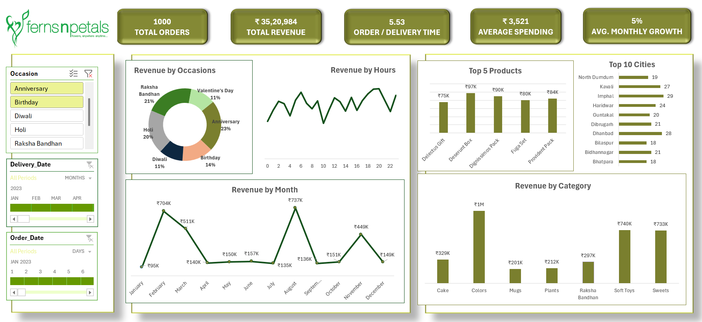
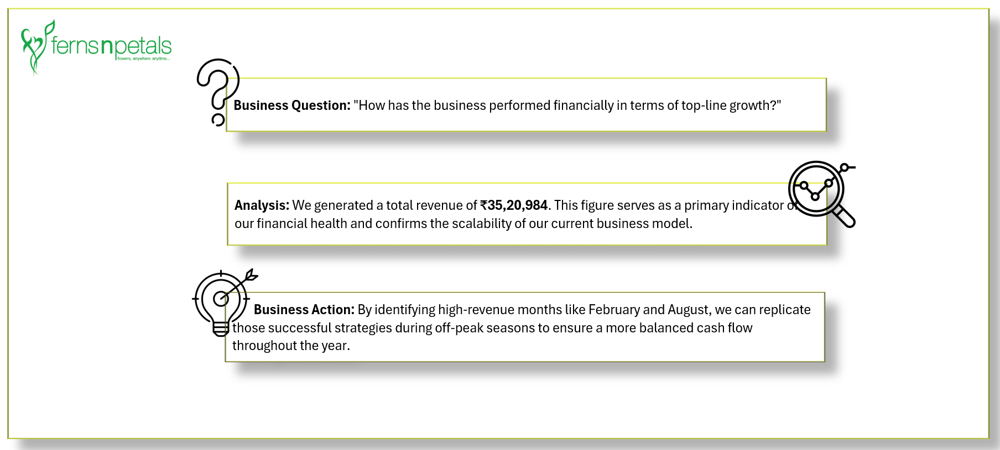
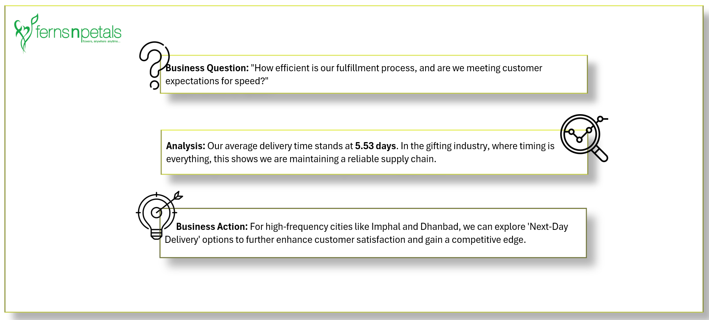

# Ferns & Petals – Sales & Business Analysis Dashboard (Excel)

## 📌 Project Overview
This project presents an end-to-end **sales and business analysis** for a gifting e-commerce brand using **Microsoft Excel**.

The objective of this project was not just to create visual dashboards, but to **answer real business questions** and translate data into **actionable insights** that support decision-making.

---

## 🧭 Executive Summary

- **Total Orders:** 1,000  
- **Total Revenue:** ₹35.2 Lakhs  
- **Average Order Value:** ₹3,520  
- **Average Delivery Time:** 5.53 Hours  
- **Average Monthly Growth:** ~5%  

The business demonstrates strong seasonal demand, premium customer behavior, and steady underlying growth beyond festive spikes.

---

## 🖥️ Dashboard Overview

An interactive Excel dashboard built using Pivot Tables, slicers, and KPI cards to provide a **360° view of business performance**.

---

## 📊 Key KPIs & Business Questions

### 🔹 Total Orders

**Business Question:**  
What is our current market reach and the overall scale of customer demand?

**Insight:**  
Processing 1,000 orders indicates stable and consistent demand across multiple regions.

---

### 🔹 Total Revenue

**Business Question:**  
How strong is the business financially in terms of top-line performance?

**Insight:**  
₹35.2L in revenue confirms strong monetization and scalability of the business model.

---

### 🔹 Order / Delivery Time

**Business Question:**  
How efficient is our order fulfillment process?

**Insight:**  
An average delivery time of 5.53 hours reflects reliable operational performance in the gifting industry.

---

### 🔹 Average Spending

**Business Question:**  
What is the average monetary value a customer brings per transaction?

**Insight:**  
An AOV of ₹3,520 indicates a mid-to-premium customer base.

---

### 🔹 Average Monthly Growth

**Business Question:**  
Is the business growing sustainably beyond seasonal spikes?

**Insight:**  
After normalizing seasonal outliers, the business shows a steady ~5% average monthly growth.

---

## 🎉 Revenue Drivers & Customer Behavior

### 🔹 Revenue by Occasions

**Insight:**  
Anniversary, Raksha Bandhan, and Holi together contribute over 60% of total revenue, reflecting both year-round and seasonal demand.

---

### 🔹 Revenue by Hours

**Insight:**  
Customer activity peaks during evening and late-night hours, indicating gifting decisions are often made after work hours.

---

### 🔹 Revenue Trends (Monthly)

**Insight:**  
Revenue shows strong seasonal spikes in February and August, while baseline months remain stable.

---

## 📦 Product & Category Performance

### 🔹 Top 5 Products

**Insight:**  
Revenue is evenly distributed across top products, reducing dependency on a single product.

---

### 🔹 Revenue by Category

**Insight:**  
Colors, Soft Toys, and Sweets dominate revenue, while Mugs and Plants present cross-selling opportunities.

---

## 🌍 Geographic Performance

**Insight:**  
Tier-2 and Tier-3 cities such as Imphal and Dhanbad outperform expectations, highlighting untapped non-metro demand.

---

## 🚀 Key Business Recommendations
- Focus marketing spend on **high-intent festive periods**
- Introduce **product bundling** to increase average order value
- Strengthen logistics during **evening peak hours**
- Prioritize expansion in high-performing **Tier-2 cities**
- Use seasonal spikes for **better cash flow planning**

---

## 🛠 Tools & Techniques Used
- Microsoft Excel  
- Power Query  
- Pivot Tables & Charts  
- Slicers & Filters  
- KPI-driven business storytelling  

---

## 📂 Files Included
- Excel Dashboard (.xlsx)
- Business Analysis Report (PDF)
- Dashboard & Insight Visuals (PNG)

---

## 🧠 Final Note
This project demonstrates how **Excel can be used as a powerful analytics tool** to drive business decisions when combined with structured thinking and storytelling.
